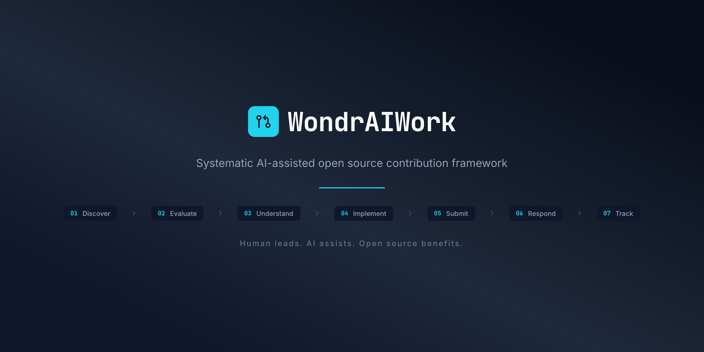
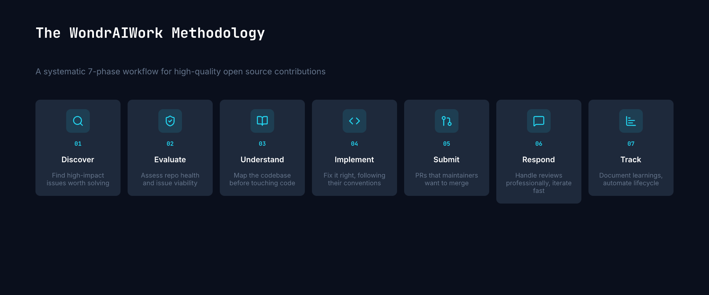

<p align="center">
  
</p>

<p align="center">
  <strong>Systematic AI-assisted open source contribution framework.</strong>
</p>

<p align="center">
  <a href="./LICENSE"></a>
  <a href="https://github.com/Kanevry/wondraiwork/issues"></a>
  <a href="https://github.com/Kanevry/wondraiwork/stargazers"></a>
</p>

---

## The Problem

The open source contribution space has a massive gap:

- **Beginner tutorials** teach you how to fork and make your first PR
- **Autonomous AI agents** try to replace human contributors entirely
- **Nothing in between** — no systematic, human-led, AI-assisted methodology for making meaningful
  contributions to any repo, in any language, at any complexity level

WondrAIWork fills that gap.

## What This Is

A complete, repeatable workflow for finding high-impact open source issues and delivering quality
fixes — fast. It's language-agnostic, complexity-independent, and designed for contributors who want
to solve real problems, not just collect "good first issue" badges.

The framework pairs a human lead with AI pair programming ([Claude Code](https://claude.ai/code))
across 7 phases:

<p align="center">
  
</p>

## Quick Start

```bash
# Clone this repo
git clone https://github.com/Kanevry/wondraiwork.git
cd wondraiwork
pnpm install

# Find high-impact issues
pnpm discover

# Evaluate a specific issue
pnpm evaluate <owner/repo> <issue-number>

# Set up a target repo for contribution
pnpm setup-target <owner/repo>
```

## Methodology

The full methodology is documented in [`methodology/`](./methodology/):

| Phase | Doc                                          | Time       | What                                                        |
| ----- | -------------------------------------------- | ---------- | ----------------------------------------------------------- |
| 01    | [Discover](./methodology/01-discover.md)     | 30-60 min  | Find issues that matter — scoring matrix, search strategies |
| 02    | [Evaluate](./methodology/02-evaluate.md)     | 15-30 min  | Assess repo health, maintainer activity, competition        |
| 03    | [Understand](./methodology/03-understand.md) | 1-3 hours  | Systematically explore unfamiliar codebases                 |
| 04    | [Implement](./methodology/04-implement.md)   | 2-8 hours  | Fix it right, following the target repo's conventions       |
| 05    | [Submit](./methodology/05-submit.md)         | 30-60 min  | PRs that maintainers want to merge                          |
| 06    | [Respond](./methodology/06-respond.md)       | Ongoing    | Handle reviews professionally, iterate fast                 |
| 07    | [Track](./methodology/07-tracking.md)        | Continuous | Document learnings, automate lifecycle                      |

See the [full process overview](./methodology/00-overview.md) for how the phases connect.

## Features

- **Discovery scripts** — Automated search across GitHub for high-impact issues using 5 strategies
  (reactions, comments, help-wanted, good-first-issue, bugs)
- **Evaluation scoring** — Quantitative assessment: Impact (40%) x Feasibility (35%) x Visibility
  (25%)
- **Codebase mapping** — Templates for systematic exploration of unfamiliar projects
- **PR quality gates** — Checklists and validation before every submission
- **Contribution journal** — Structured documentation of learnings and outcomes
- **Target tracking** — Scored and validated contribution opportunities

## Contribution Targets

Active targets are tracked in [`targets/`](./targets/), scored by tier:

| Tier                     | Focus                                      | Count |
| ------------------------ | ------------------------------------------ | ----- |
| **Tier 1** — Quick Wins  | Low complexity, high merge probability     | 3     |
| **Tier 2** — High Impact | Meaningful fixes in major projects         | 7     |
| **Tier 3** — Emerging    | Smaller projects, broader impact potential | 8     |

Each target file documents the issue, repo health, scoring, approach, and current status.

## Contribution Journal

Completed contributions are documented in [`contributions/`](./contributions/). Each entry records
what was done, what was learned, and the outcome.

## Philosophy

- **Human judgment, AI speed** — The human decides what to work on and validates the approach. AI
  handles the tedious parts: searching, reading, drafting.
- **Repo-native standards** — We follow the target repo's conventions, not our own. Their linter,
  their commit format, their test framework.
- **Quality over quantity** — One well-crafted PR beats ten sloppy ones. Every contribution should
  be something the maintainer is glad to receive.
- **Learn in public** — The methodology, the targets, the journal — it's all here. Copy it, improve
  it, make it yours.

## AI Transparency

WondrAIWork uses AI tools (primarily [Claude Code](https://claude.ai/code)) as a pair programming
partner. We believe in full transparency about AI usage in open source contributions.

See our [AI Attribution Policy](./AI-ATTRIBUTION.md) for details on how we handle AI disclosure.

## Contributing

Contributions are welcome — methodology improvements, case studies, script enhancements, new
targets, documentation fixes. See [CONTRIBUTING.md](./CONTRIBUTING.md) for guidelines.

## License

[MIT](./LICENSE) — use it however you want.

---

Built by [Bernhard Goetzendorfer](https://github.com/Kanevry) with
[Claude Code](https://claude.ai/code).
